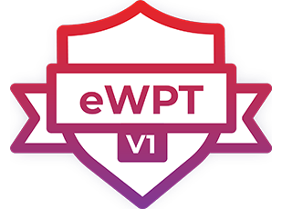

# eWPT

## Notes

In this repository I've shared my notes for the eWPT course. The notes are written in [Joplin](https://joplinapp.org/) and I've exported the cheatsheet notes as a Joplin export file (.jex). This can be imported in Joplin.

## Disclaimer 

The knowledge shared within this repository may only be used within the eWPT course, your own pentestlab, CTF event or your assigned pentest job.

You are responsible for your own actions, so don't be stupid and use this knowledge for good. If you would like to practice, take a look at some OWASP projects, or Portswigger Academy.

